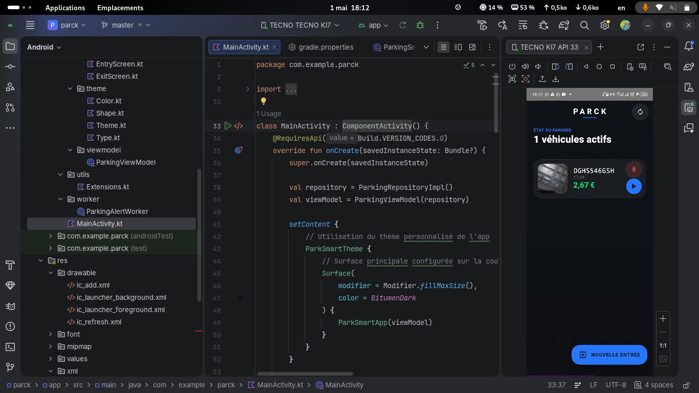

# 🅿️ ParkSmart


**ParkSmart** est une application Android performante dédiée à la gestion intelligente des véhicules et des espaces de stationnement. Développée avec une approche "Performance First", elle combine la modernité de **Jetpack Compose** et la puissance de **Supabase** pour offrir une expérience fluide et sécurisée.

---

## Resultat final




---

## 🛠 Stack Technique & Environnement

Le développement de ParkSmart suit des standards rigoureux pour garantir stabilité et rapidité :

*   **Langage** : Kotlin avec Coroutines pour une gestion asynchrone sans blocage.
*   **UI Framework** : Jetpack Compose (Material Design 3).
*   **Backend** : Supabase (PostgreSQL & Auth).
*   **Environnement de Dev** : Développé sous **Kali Linux** avec une gestion optimisée des services système.
*   **Architecture** : MVVM (Model-View-ViewModel) pour une séparation claire des responsabilités.

---

## 🚀 Fonctionnalités Clés

*   **Gestion de Flotte** : Suivi détaillé des véhicules (Marque, Modèle, Statut).
*   **Synchronisation Cloud** : Persistance des données en temps réel via Supabase.
*   **Optimisation de l'UI** : Réduction drastique des "skipped frames" grâce à une initialisation asynchrone des ressources.
*   **Sécurité Renforcée** : Implémentation du `Network Security Config` pour chiffrer les échanges avec le backend.

---

## 📦 Installation (Mode Développeur)

Étant donné ma préférence pour les installations manuelles et contrôlées, voici la procédure recommandée :

1.  **Clonage du dépôt** :
    ```bash
    git clone [https://github.com/Glan-kig/parck.git](https://github.com/Glan-kig/parck.git)
    cd park
    ```
2. **Compilation via Terminal** :
    ```bash
    ./gradlew assembleDebug
    ```

---

## 🛡 Sécurité et Performances

L'application a été auditée pour répondre aux problématiques suivantes identifiées lors du développement :
*   **Thread Safety** : Déplacement des appels réseaux lourds hors du thread principal pour garantir 60 FPS.
*   **Politique Réseau** : Restriction du trafic aux domaines de confiance via `xml/network_security_config`.
*   **Gestion des Ressources** : Optimisation de la mémoire pour les terminaux Android à ressources limitées.

---

## 📅 Roadmap

- [ ] Intégration d'un module de tri avancé (inspiré des algorithmes de tri en C).
- [ ] Mode hors-ligne avec base de données locale.
- [ ] Exportation des rapports de stationnement en **LaTeX**.

---
**Développé par Glan**  
*Expertise en développement système et intégration d'outils performants.*